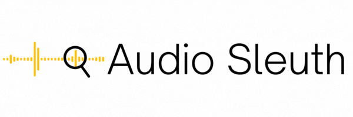

<p align="center">
  
</p>


# Audio Sleuth 

A torch based open-source framework for detecting audio generated from generative systems. The overarching goal of this repository is to be a toolbox for datasets, augmentations, and pretrained baseline models to assist researchers in the task of audio deepfake detection.

## Install

To install, simply use pip:

```
pip install audio-sleuth
```

## Usage

The goal of this package is to contain augmentations, models, and losses all as a `torch.nn.Module` class. Each augmentation contains an internal `LabelAlignment` such that you can implement various time-frequency transformations to automatically translate the sample-wise labels as well. 

Here is an example of how to chain together augmentations on the Half Truth Dataset.

```python
from audio_sleuth.augmentations import Resample, LFCC, Augmentations
from audio_sleuth.data.datasets import HalfTruthDataset 

# Augmentation chain
transform = Augmentations(
  [
    Resample(input_sr=48000, new_sr=16000, return_original_sr=False), # Downsample block
    LFCC(
      fs=16000, n_fft=512, hop_size=128, win_size=128, n_filters=128, n_lfcc=40 # LFCC augmentation
    )
  ]
)

# Returns torch Dataset that can be fed into DataLoader
dataset = HalfTruthDataset(
  path_to_txt, # Initialize to your txt file of filepaths and labels from dataset
  fs=16000
)
```

However, I'm a sole dev - these things don't work together yet.

TODO:

- [ ] Enable transformations on datasets
- [ ] Downloaders for datasets
- [ ] Melspec, spec augmentations
- [ ] Evaluate method, maybe enable eval in loop